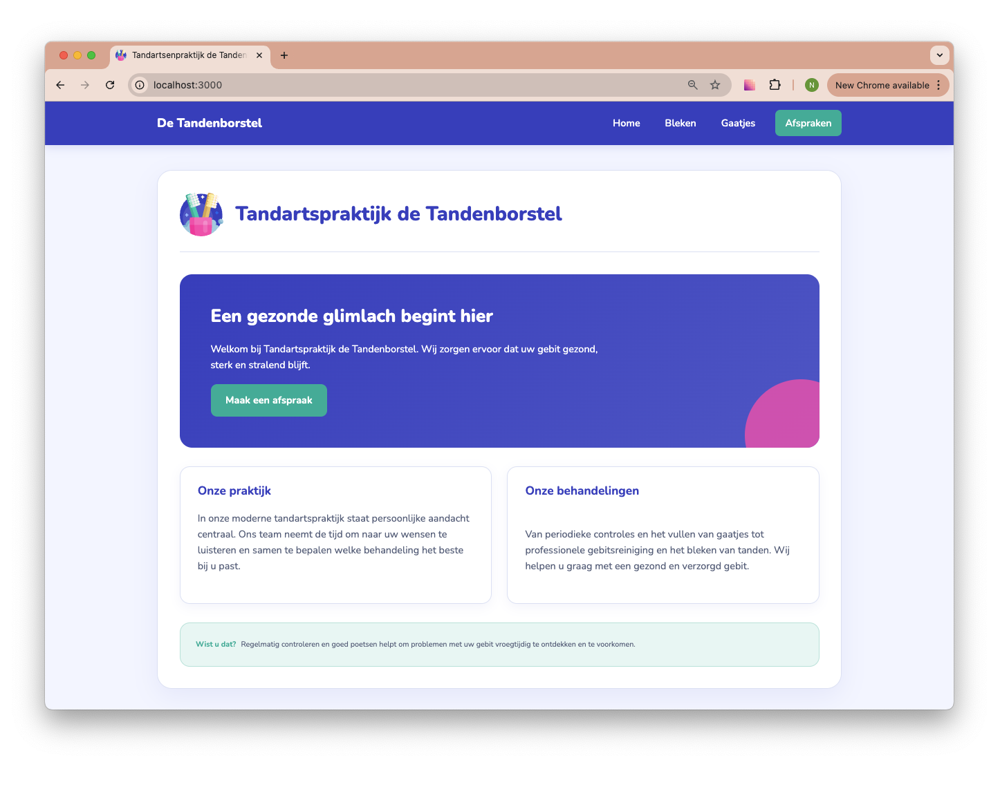
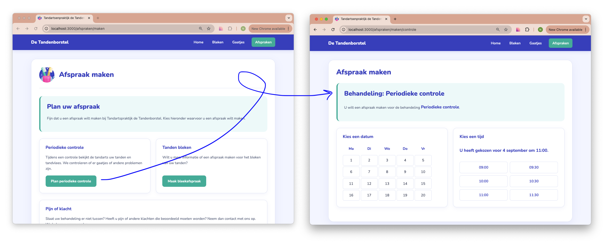
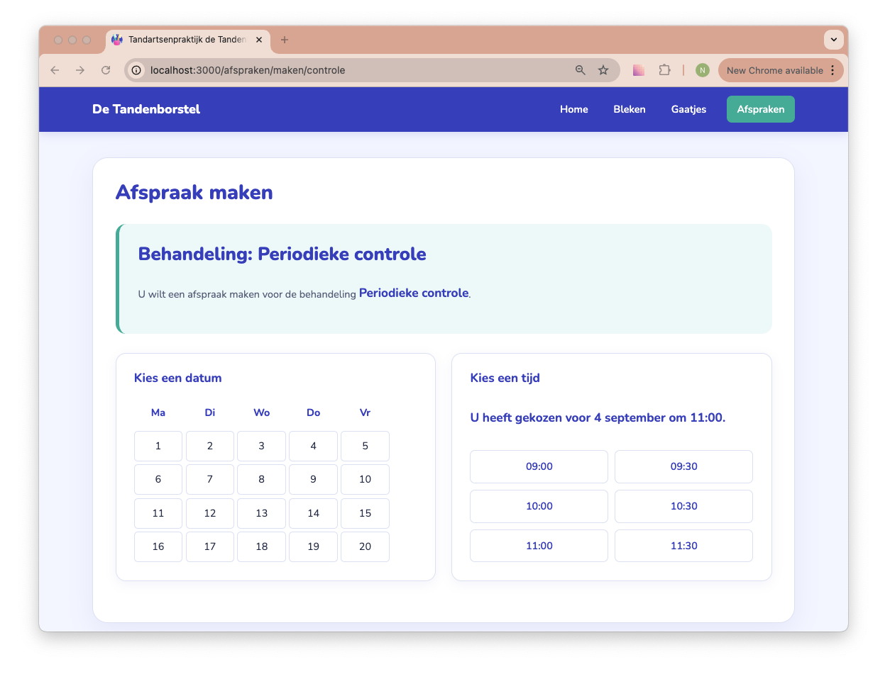

# Opdrachtbeschrijving

## Inleiding
In deze opdracht ga je een bestaande Next.js-applicatie met Typescript verder uitbouwen voor Tandartspraktijk de
Tandenborstel. Die herken je misschien nog wel! Je gaat onder andere werken met routing, nested routes, dynamic routes en Client Components.

De basis van het project is al voor je klaargezet. De styling en het logo zijn al aanwezig. Het is aan jou om de structuur en functionaliteit van de applicatie met Next.js op te bouwen.

> **Belangrijk:** probeer tijdens deze opdracht zo min mogelijk direct naar ChatGPT te grijpen. Zoek eerst zelf naar antwoorden in de officiële Next.js-documentatie. Je leert hierdoor niet alleen wat je moet doen, maar ook hoe je documentatie kunt lezen en interpreteren.



## Applicatie starten

Als je het project gecloned hebt naar jouw locale machine, installeer je eerst de node_modules door het volgende
commando in de terminal te runnen

```bash
npm install
```

Wanneer dit klaar is, kun je de applicatie starten met behulp van:

```bash
npm run dev
```

... of gebruik de WebStorm knop (npm run dev). Open http://localhost:3000 om de pagina in de browser te bekijken. Begin
met het maken van wijzigingen in `src/page.tsx`.

## Opdrachtbeschrijving

Begin met het lezen van de officiële Next.js-documentatie. Je hoeft nog niet alles te begrijpen. Probeer vooral een globaal beeld te krijgen van:

* hoe een Next.js-project is opgebouwd;
* wat de `app`-map doet;
* hoe pagina's worden gemaakt;
* hoe routing werkt;
* wat Server Components en Client Components zijn.

> "Wat is volgens jou het belangrijkste verschil tussen een traditioneel React-project en een Next.js-project?"

### 1. Pas de metadata aan
Pas de titel van de website aan, zodat in het browsertabblad de naam van de tandartspraktijk wordt weergegeven.

In de public-map zit een SVG-bestand met het logo van de tandartspraktijk. Zorg ervoor dat dit logo in het browsertabblad wordt gebruikt in plaats van het standaard Next.js-logo.

### 2. Navigatie

De website moet op iedere pagina dezelfde navigatie bevatten. Maak hiervoor een herbruikbaar Navigation-component en onderzoek in de documentatie wat de juiste manier is om zo'n component te gebruiken op de pagina. De navigatie moet minimaal de volgende links bevatten:
* `/`
* `gaatjes`
* `bleken`
* `afspraken`

Gebruik voor de links de Next.js-manier van navigeren.


Voor de styling is het belangrijk dat je deze structuur aanhoudt:

```html
<nav>
    <div className="navigation-container">
				...
		</div>
</nav>
```
Daarbinnen kun je de volgende CSS-classes op de elementen gebruiken:

* `.navigation-company-name`
* `.navigation-links`
* `.navigation-button` (Let op: de button linkt naar een andere pagina, dus dat is geen echt `<button>`-element)

### 3. Routing

Maak voor iedere route een pagina en zet de routingstructuur op. De inhoud van deze pagina's mag in eerste instantie heel eenvoudig zijn. Geef iedere pagina bijvoorbeeld een eigen `<h1>` met de naam van de pagina. Controleer vervolgens of je via de navigatie daadwerkelijk naar iedere pagina kunt gaan.

Maar: niet iedere URL die een gebruiker intypt zal bestaan. Maak daarom een eigen 404-pagina die wordt weergegeven wanneer een gebruiker naar een route gaat die niet bestaat. Test dit door een URL te bezoeken die je zelf niet hebt aangemaakt.

### 5. Content

Nu de routing werkt, kunnen de pagina's worden gevuld met de HTML/JSX die voor deze opdracht is aangeleverd. Gebruik hiervoor de voorbeelden hieronder. Let bij het overnemen van de voorbeelden op dat je HTML omzet naar geldige JSX wanneer dat nodig is. Zorg er daarnaast voor dat links naar andere pagina's gebruikmaken van de Next.js-manier van navigeren.


```html
<!-- Bleken pagina -->
<main className="page-container">
    <Header icon="/logo.svg" title="Bleken" />

    <section className="intro">
        <h2>Een stralend witte glimlach</h2>
        <p>
            Wilt u uw tanden een paar tinten lichter maken? Met professioneel
            tanden bleken kunt u op een veilige manier een stralendere glimlach
            krijgen. Op deze pagina leest u hoe het proces in zijn werk gaat.
        </p>
    </section>

    <section className="card-container">
        <article className="card">
            <h3>1. Intake</h3>
            <p>
                Tijdens een eerste afspraak bekijken we uw gebit en bespreken we
                uw wensen. We bepalen samen of tanden bleken geschikt voor u is.
            </p>
        </article>

        <article className="card">
            <h3>2. Behandeling</h3>
            <p>
                Onze tandarts geeft uitleg over de behandeling en zorgt ervoor
                dat het bleken op een professionele en verantwoorde manier
                gebeurt.
            </p>
        </article>

        <article className="card">
            <h3>3. Resultaat</h3>
            <p>
                Na de behandeling zijn uw tanden zichtbaar lichter. Hoeveel het
                resultaat verschilt, hangt onder andere af van de oorspronkelijke
                kleur van uw tanden.
            </p>
        </article>
    </section>

    <section className="box warning-box">
        <h3>Goed om te weten</h3>
        <p>
            Niet iedereen kan zijn tanden laten bleken. Laat uw gebit daarom
            altijd eerst controleren door één van onze tandartsen.
        </p>
    </section>
</main>
```

```html
<!-- Gaatjes pagina-->
<main className="page-container">
    <Header icon="/logo.svg" title="Gaatjes" />

    <section className="intro">
        <h2>Heeft u last van een gaatje?</h2>
        <p>
            Een gaatje ontstaat wanneer bacteriën in tandplak zuren produceren
            die het tandglazuur aantasten. Gelukkig kan een gaatje meestal goed
            worden behandeld wanneer het op tijd wordt ontdekt.
        </p>

        <a href="#" className="link-button">Maak direct uw afspraak</a>
    </section>

    <section className="card-container">
        <article className="card">
            <h3>Hoe herken ik een gaatje?</h3>
            <p>
                Een gaatje kan gevoeligheid veroorzaken bij het eten of drinken
                van iets kouds, warms of zoets. Soms is er helemaal geen pijn en
                wordt een gaatje tijdens een controle ontdekt.
            </p>
            <p>
                Daarom is het belangrijk om regelmatig naar de tandarts te gaan,
                ook wanneer u geen klachten heeft.
            </p>
        </article>

        <article className="card">
            <h3>Hoe wordt het behandeld?</h3>
            <p>
                De tandarts verwijdert het aangetaste gedeelte van de tand en
                vult de ontstane ruimte met een vulling. De behandeling voorkomt
                dat het gaatje verder groter wordt.
            </p>
            <p>
                Hoe eerder een gaatje wordt ontdekt, hoe eenvoudiger de
                behandeling meestal is.
            </p>
        </article>
    </section>

    <section className="card">
        <h3>Voorkomen is beter dan genezen</h3>
        <p>
            Poets minimaal twee keer per dag met fluoridehoudende tandpasta en
            maak dagelijks de ruimtes tussen uw tanden schoon.
        </p>
    </section>
</main>
```

```html
<!--Afspraken pagina-->
<main className="page-container">
    <Header icon="/logo.svg" title="Afspraken"/>

    <section className="intro">
        <h2>Een afspraak maken</h2>
        <p>
            Wilt u een controle plannen, heeft u een klacht of wilt u meer
            informatie over een behandeling? Neem dan contact met ons op. Bij ernstige pijn, een afgebroken tand
            of een ongeval kunt u het beste direct telefonisch contact met ons opnemen.
        </p>
    </section>

    <section className="card-container">
        <article className="card">
            <h3>Telefonisch</h3>
            <p>U kunt ons tijdens openingstijden telefonisch bereiken.</p>
            <strong>030 - 123 45 67</strong>
        </article>

        <article className="card">
            <h3>Openingstijden</h3>
            <p>Maandag t/m vrijdag</p>
            <p>08:00 - 17:00 uur</p>
        </article>

        <article className="card">
            <h3>Online afspraken</h3>
            <p>Wilt u een controle plannen of heeft u een klacht? U kunt eenvoudig een afspraak maken.</p>
            <a href="#" className="link-button"> Maak een afspraak </a>
        </article>
    </section>
</main>
```

### 4. Nested route

Een gebruiker moet vanuit de afsprakenpagina kunnen doorklikken naar de plek waarop de afspraak daadwerkelijk kan worden gepland. De URL daarvoor moet worden:

`/afspraken/maken`

Dit is een **nested route**. Nested routes zie je vooral wanneer een pagina onderdeel is van een grotere structuur, zoals webshops met productcategorieën. Pas je mappenstructuur zo aan dat deze URL automatisch door Next.js wordt herkend. Geef de nieuwe pagina eerst een eenvoudige titel om te controleren of de routing werkt. Daarna kun je deze vullen met de volgende HTML:

```html
<main className="page-container">
    <Header icon="/logo.svg" title="Afspraak maken" />

    <section className="intro">
        <h2>Plan uw afspraak</h2>
        <p>
            Fijn dat u een afspraak wilt maken bij Tandartspraktijk de
            Tandenborstel. Kies hieronder waarvoor u een afspraak wilt maken.
        </p>
    </section>

    <section className="card-container">
        <article className="card">
            <h3>Periodieke controle</h3>
            <p>
                Tijdens een controle bekijkt de tandarts uw tanden en
                tandvlees. We controleren of er gaatjes of andere problemen
                zijn.
            </p>
            <a href="#" className="link-button">
            Plan periodieke controle
            </a>
        </article>

        <article className="card">
            <h3>Tanden bleken</h3>
            <p>
                Wilt u meer informatie of een afspraak maken voor het bleken
                van uw tanden?
            </p>
            <a href="#" className="link-button">
            Maak bleekafspraak
            </a>
        </article>
    </section>

    <section className="card-container">
        <article className="card">
            <h3>Pijn of klacht</h3>
            <p>
                Staat uw behandeling er niet tussen? Heeft u pijn of andere klachten die beoordeeld moeten worden? Neem dan contact met ons op. We helpen u graag verder.
            </p>
            <a href="#" className="link-button">
            Neem contact op
            </a>
        </article>
    </section>

    <section className="box info-box">
        <h3>Wat gebeurt er daarna?</h3>
        <p>
            Nadat u uw behandeling heeft gekozen, kunt u een geschikt moment
            selecteren. In deze oefening is het vervolg nog niet uitgewerkt.
        </p>
    </section>
</main>
```

### 6. Dynamic route
De tandartspraktijk biedt verschillende behandelingen aan waarvoor een afspraak gemaakt kan worden.

Op dit moment zijn er bijvoorbeeld:
* een periodieke controle;
* tanden bleken;
* een klacht, zoals pijn of een uitgevallen kies.

In de toekomst kunnen daar nieuwe behandelingen bij komen. In plaats van voor iedere behandeling een aparte pagina te maken, gaan we daarom gebruikmaken van een dynamic route, waarbij de pagina zich aanpast op basis van de url.



De URL's moeten bijvoorbeeld worden:
* `/afspraken/maken/controle`
* `/afspraken/maken/bleken`
* `/afspraken/maken/klacht`

Maak hiervoor een dynamic route met bijbehorende pagina. Wanneer een gebruiker bijvoorbeeld naar: `/afspraken/maken/bleken` gaat, moet op de pagina de naam van de behandeling worden weergegeven ("Tanden bleken"). Gebruik deze array om op de pagina te bepalen welke behandelingen bij welke url hoort:

```js
const treatments = [
{ url: "controle", name: "Periodieke controle" },
{ url: "bleken", name: "Tanden bleken" },
{ url: "klacht", name: "Pijn of klacht" },
];
```

Wat gebeurt er als iemand `/afspraken/maken/fietsen` intypt? Dat is natuurlijk niet de bedoeling! Zorg ervoor dat een gebruiker in dat geval wordt doorgestuurd naar de 404-pagina.

> Wat is het verschil tussen een URL waarvoor helemaal geen route bestaat en een URL die wel bij een dynamic route past, maar waarvan de slug geen geldige behandeling is?

### 7. Afspraak maken
De pagina voor een specifieke behandeling bevat een eenvoudige kalender en een lijst met beschikbare tijden. Op dit moment zijn deze elementen nog statisch: de gebruiker kan niets selecteren. Gebruik de volgende HTML en controleer of de naam van de behandeling op de juiste plaats wordt weergegeven.

```html
<main className="page-container">
    <h1>Afspraak maken</h1>
    <section className="intro">
        <h2>Behandeling: ...</h2>
        <p> U wilt een afspraak maken voor de behandeling <strong> ... </strong>.</p>
    </section>
    <section className="card-container">
        <article className="card">
            <h2>Kies een datum</h2>
            <div className="calendar-grid">
                <span>Ma</span>
                <span>Di</span>
                <span>Wo</span>
                <span>Do</span>
                <span>Vr</span>
								
								{Array.from({length: 29}, (item, index) => ( <span key={index}>{index + 1}</span> ))}
            </div>
        </article>
        <article className="card calendar">
						<h2>Kies een tijd</h2>
            <div className="time-list">
                <button>09:00</button>
                <button>09:30</button>
                <button>10:30</button>
                <button>11:00</button>
                <button>11:30</button>
                <button>13:30</button>
                <button>14:30</button>
                <button>15:00</button>
                <button>15:30</button>
            </div>
        </article>
    </section>
</main>
```

Het hardcoded declareren van de tijden in de HTML is natuurlijk een beetje suf. Gebruik deze array om dit efficiënter weer te geven:

```js
const times = [ "09:00", "09:30", "10:00", "10:30", "11:00", "11:30"];
```

> Waarom is het in dit geval handiger om de times-array _buiten_ de functie te declareren in plaats van binnen de functie?

Breng nu de kalender met tijd-selectie onder in een **apart component**, die je gebruikt op deze pagina. Geef de `times`-array vanaf de pagina door als prop.

> Om de kalender interactief te maken hebben we state nodig. Wat moet je in Next.js doen om gebruik te kunnen maken van state?

In ons component willen we met behulp van state bijhouden welke datum de gebruiker heeft geselecteerd. Houd op dezelfde manier bij welke tijd de gebruiker heeft geselecteerd wanneer de gebruiker op een waarde klikt. Om dit visueel te maken kun je de class `selected` op een actief span-element zetten.

Wanneer zowel een datum als een tijd zijn gekozen, toon je de gemaakte keuze boven de tijden. Voor nu gaan we er even vanuit dat alle voorgestelde datums in september zijn. Bijvoorbeeld: "U heeft gekozen voor 12 september om 10:30."


